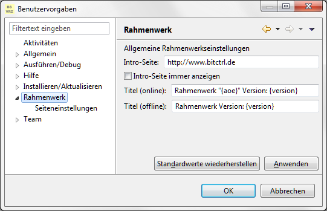

Standardinformationen
=====================

## Hintergrund

Das Rahmenwerk bietet Funktionen, um statische Standardinformationen zu präsentieren.
Diese werden beispielsweise im Titel des Workbenchfensters eingeblendet und können 
über entsprechende Controls in der Statuszeile des Hauptfensters eingeblendet werden.

Die Ausgabe der Informationen erfolgt über einen Formatstring, in dem die gewünschten
statischen Informationen per Platzhalter eingebaut sind. Die Platzhalter werden durch
vordefinierte Kürzel, die in geschweifte Klammern eingebettet sind gebildet.

Folgende Platzhalter stehen zur Verfügung:

- **{user}** für den Name des angemeldeten Benutzers
- **{userpid}** für die PID des angemeldeten Benutzers
- **{host}**  für den Hostname aus der Datenverteileranmeldung
- **{port}**  für den Port aus der Datenverteileranmeldung
- **{simvar}** für die eingestellte Standardsimulationsvariante
- **{aoe}** für den Name der verwendeten AOE
- **{aoepid}** für die PID der verwendeten AOE
- **{version}** für die Versionsnummer der Rahmenwerksoftware

## Informationen im Titel des Hauptfensters der Rahmenwerkanwendung

Die im Titel des Rahmenwerk-Hauptfenster angezeigten Informationen werden als
lokale Einstellungen abgelegt.

 

Einstellbar ist ein Titelformat für den Offline-Betrieb und ein Titel 
für den Online-Betrieb. Die Standwerte sind im Bild oben dargestellt.

## Informationen in der Statusleiste des Hauptfensters

Für die Anzeige der statischen Informationen in der Statusleiste wird ein Control
bereitgestellt, das über den Menüeditor in die Statusleiste eingebaut werden kann.

 

Das Bild zeigt das entsprechende Element im Menüeditor des Rahmenwerks. 

Das auszugebende Format wird über die Parameter "Format im Offlinebetrieb" 
und "Format im Onlinebetrieb" definiert.

## Programmierschnittstelle   

Die allgemeinen statischen Informationen können auch in eigenen Anwendungen eingesetzt
werden.

Das Enum *RwInfoDef* bietet eine statische Funktion, mit ein Formatstring mit den oben
genannten Platzhaltern in einen mit Informationen befüllten String ausgegeben werden
kann.

```java
public enum RwInfoDef {
    .....

    /**
     * liefert den formatierten Informationsstring, die enthaltenen Platzhalter
     * werden entsprechend ersetzt.
     * 
     * @param formatStr
     *            der Formatstring
     * @return der resultierende String
     */
    public static String format(final String formatStr) {
        return VERSION.berechneString(formatStr);
    }

    .....
}
```
