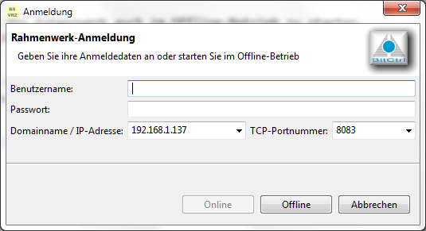

Title:   Rahmenwerk 2.0 - Anmeldung beim Rahmenwerk/Datenverteiler  
Author:  U. Peuker  
Date:    August 30, 2013  
Comment: Konfiguration und Verwendung des Anmeldedialogs des Rahmenwerks 2.0

# Anmeldung beim Datenverteiler

## Hintergrund

Eine wesentliche Aufgabe des Rahmenwerks besteht in der Bereitstellung der Verbindung
zu einem Datenverteilersystem.

Die Herstellung der Verbindung erfolgt durch einen Login-Dialog, der beim Start der 
Rahmenwerksapplikation angezeigt wird und die Möglichkeit bietet, sich mit entsprechend
gültigen Anmeldedaten mit einem System zu verbinden.

Optional besteht die Möglichkeit das Rahmenwerk auch im Offline-Betrieb zu starten. 
Dabei steht für die Plug-ins in der Regel nur eine eingeschränkte Funktionalität zur 
Verfügung.

Aus dem Offline-Betrieb kann die Datenverteilerverbindung durch Ausführen des Kommandos 
"Anmelden" hergestellt werden. Es öffnet sich der gleiche Login-Dialog wie beim Starten 
des Rahmenwerks.



## Konfiguration des Dialogs

Der Dialog kann in gewissen Grenzen an die Erfodernisse der konkreten Anwendung angepasst
werden. Die Anpassung erfolgt über Kommandozeilen-Parameter, die den Rahmenwerk beim Start
mitgegeben werden. 

Folgende Optionen sind vorgesehen:

```bash
-loginLogo=<Pfad zu einer Imagedatei>
```
Die Option bestimmt das Logo, dass im Logindialog angezeigt wird. Das Image wird ohne 
Rahmen eingepasst, d.h. dieser sollte Bestandteil der verwendeten Grafik sein!

```bash
-loginDialogTitel=<Text für den Dialogtitel>
```
Die Option bestimmt den Titel des Dialogfensters. Der Standwert ist "Anmeldung".

```bash
-loginTitel=<Text für den Titel>
```
Die Option bestimmt den Titel im Kopfbereich des Dialogs. 
Der Standwert ist "Rahmenwerk-Anmeldung".

```bash
-loginMessage=<Text für den Meldungstext>
```
Die Option bestimmt den Text im Kopfbereich des Dialogs. 
Der Standwert ist "Geben Sie ihre Anmeldedaten an oder starten SIe im Offline-Betrieb"

```bash
-disableHost
```
Mit dieser Option wird die Anzeige der Eingabefelder für den Host und den Port für
die Datenverteilerverbindung unterdrückt. Stattdessen werden die Angaben aus dem Standard-
Datenverteiler-Startargument *-datenverteiler* übernommen. Falls dieses fehlt, werden die 
Standardwerte *localhost* und *8083* verwendet.
Die Option bestimmt den Text im Kopfbereich des Dialogs. 
Der Standwert ist "Geben Sie ihre Anmeldedaten an oder starten SIe im Offline-Betrieb"

Der Dialog wird immer an der Position geöffnet, an der er zuletzt geschlossen wurde.
Insbesondere auf einem Multi-Monitor-System muss daher die korrekte Position einmalig
durch eine Anmeldung oder einen Start des Rahmenwerks im Offline-Betrieb festgelegt
werden.

## Verwendung der Datenverteilerverbindung

Die durch die Anmeldung hergestellte Datenverteilerverbindung wird allen Komponenten
des Rahmenwerks über den Service vom Typ *Rahmenwerk* zur Verfügung gestellt.

Der Service bietet auch die Möglichkeit, Änderungen des Verbindungsstatus, d.h. Abmeldungen
und erneute Anmeldungen per Listener zu beobachten.

Detaillierte Informationen dazu finden sich im Kapitel "Services".


