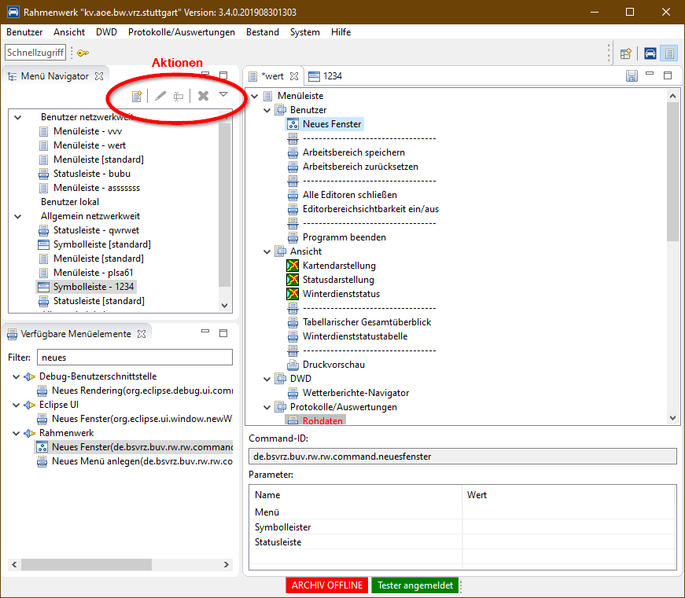

Title:   Rahmenwerk 2.0 - Menüs und Toolbars 
Author:  U. Peuker  
Date:    August 30, 2013  
Comment: Menüs und Toolbars im Rahmenwerk 2.0
         Implementierung und Verwendung des Menüeditors

Menüs und Toolbars
==================

## Hintergrund

Das Hauptmenü und die Toolbars (Haupt-Toolbar und Statuszeile) sind innerhalb des 
Rahmenwerks editierbar und können damit für die individuellen Erfordernisse einer
konkreten Datenverteiler-Anwendung angepasst werden.

Menüs und Toolbars werden generell gleich behandelt, deshalb steht für die Erstellung
der gleiche Editor zur Verfügung, lediglich das Ziel der angezeigten Funktionselemente
unterscheidet sich. Es stehen auch die gleichen Ressourcen zur Verfügung. Praktisch
sind aber nicht alle Elemente sinnvoll gleichermaßen in Menü, Toolbar und Symbolleiste
verwendbar. Eine softwareseite Unterstützung wird hierbei noch nicht geboten, es wird
auf die Intuition und die Intelligenz des Menübearbeiters gesetzt.

Die erstellten Strukturen für Menüs (im weiteren Sinne) werden als Einstellungen
im Datenverteiler hinterlegt. Damit steht die Möglichkeit zur Verfügung ein Menü
individuell für einen bestimmten Nutzer oder individuell für einen lokalen Arbeitsplatz
zu definieren.

Aktiviert wird das in der folgenden Suchreihenfolge zuerset gefundene Menü:

- lokales nutzerspezifisches Menü
- netzwerkweites nutzerspezifisches Menü
- netzwerkweites allgemeines Menü
- lokales allgemeines Menü

Da im Offline-Betrieb nur der lokale allgemeine Einstellungsspeicher zur Verfügung steht, 
wird hier immer diese Menüdefinition verwendet! 

## Menüeditor

Der Menüeditor steht als Perspektive zur Verfügung, die aus einer Ansicht mit den für
Menüs verfügbaren Elementen und dem Bereich für Editoren besteht.



Ein Editor wird über die jeweilige Schaltfläche (Menü, Toolbar, Statusleiste) in der 
Ansicht der verfügbaren Elemente geöffnet. Dabei erfolgt die Abfrage welches Menü aus 
den Einstellungen geladen werden soll.

Wird beim Betätigen der Schaltflächen zum Öffnen eines Editors gleichzeitig die CTRL-Taste
betätigt, wird ein leerer Editor geöffnet.

Die gewünschten Elemente können wie gewohnt per Drag & Drop in das Menü eingefügt und 
dort angeordnet werden. Untermenüs werden per Kontextmenü-Funktion im Editor erzeugt.

Eine im Menüeditor befindliche Struktur kann per Kontextmenü sofort aktiviert werden.
Ansonsten erfolgt die Aktivierung automatisch beim Speichern des Menüs (nach den oben
genannten Kriterien).

## Ressourcen für Menüelemente
 
### Allgemein
 
Alle verfügbaren Menü-Elemente werden von Plug-ins über ExtensionPoints zur Verfügung
gestellt. 

Mögliche Quellen sind:

- Actions aus ExtensionPoints vom Typ *ActionSet* (sollten nicht mehr verwendet werden,
  da dieser ExtensionPoint seit Eclipse Version 2.1 auf deprecated gesetzt wurde)
- ExtensionPoints vom Typ *Command*
- ExtensionPoints vom Typ *ToolbarControl*

### ToolbarControl

sind sind spezielle Contribution-Items, die weder durch Commands noch Actions 
repräsentiert werden können, beispielsweise Zeitanzeige, Statusanzeigen für Elemente
des Systems, Informationsanzeigen, ....

Sie müssen die Schnittstelle:

```java
public interface RwMenuControl extends IContributionItem {

    /**
     * übergibt der Instanz die im Menüeditor eingestellten Parameter für das
     * Element.
     * 
     * @param parameter
     *            die Parameter als Zurodnungsliste (ID, Wert)
     */
    void setParameter(Map<String, String> parameter);

    /**
     * ermittelt, ob das Element im Hauptmenü des Rahmenwerks verwendet werden
     * kann.
     * 
     * @return den Status
     */
    boolean useInMenue();

    /**
     * ermittelt, ob das Element in der Symbolleiste des Rahmenwerks verwendet
     * werden kann.
     * 
     * @return den Status
     */
    boolean useInToolbar();

    /**
     * ermittelt, ob das Element in der Statusleiste des Rahmenwerks verwendet
     * werden kann.
     * 
     * @return den Status
     */
    boolean useInStatusLine();
}
```

implementieren und als *control* in einem ExtensionPoint vom Typ 
*de.bsvrz.buv.rw.rw.toolbarcontrol* in das System integriert werden.


 
