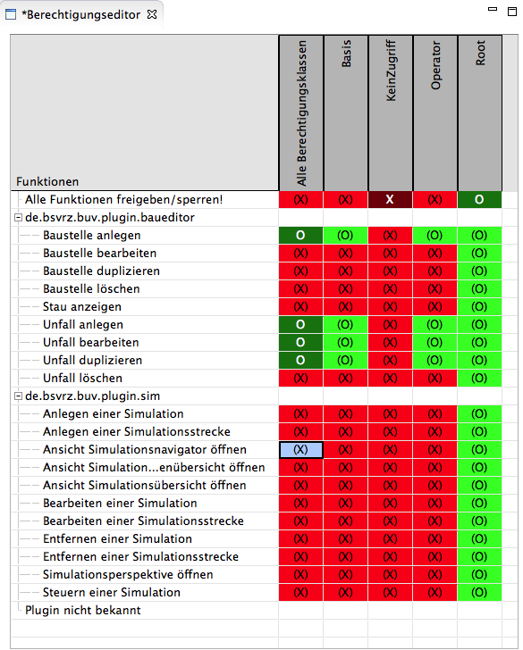
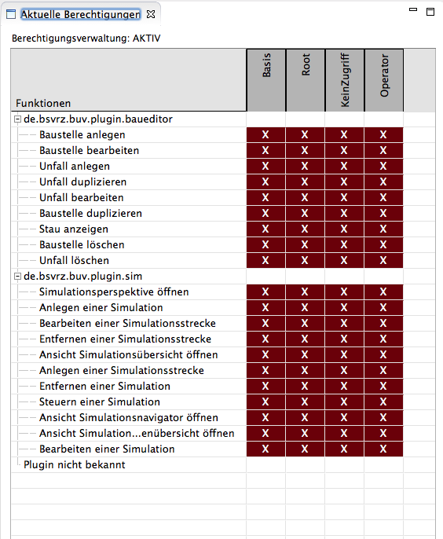

# Berechtigungen

## Hintergrund

Berechtigungen werden im Rahmenwerk als abstrakte Definitionen betrachtet, 
denen bezogen auf eine gegebene Benutzerklasse das Attribut Freigabe oder Sperrung 
zugeordnet werden kann.

Die Funktionen mit Berechtigungen sind insofern abstrakt, dass sie nicht unbedingt 
Funktionen in Sinne von konkreten Aktionen, sondern alternativ auch andere 
Eigenschaften wie Sichtbarkeit, Bedienbarkeit, Filterung bestimmter Eigenschaften 
usw. definieren können.

Eine Oberflächenfunktion definiert sich im Rahmenwerk 2.0 durch folgende Eigenschaften:
- ID der Funktion
- Name der Funktion
- Beschreibung der Funktion
- Kategorie

Oberflächenfunktionen können dynamisch durch die zur Verfügung stehenden API-Funktionen
in die Berechtigungsverwaltung des Rahmenwerks integriert werden. 
Auf welche Art und Weise die Funktionen konkret definiert werden ist durch das Rahmenwerk 
nicht festgelegt. Es kann sich gleichermaßen um Funktionsdefinitionen im Sourcecode eines 
entsprechenden Plug-Ins handeln, wie um Definitionen über Extension-Points 
oder externe Konfigurationsdateien.

**Zu bevorzugen ist jedoch die Definition von ExtensionPoints!**

Die Kategorie der Oberflächenfunktionen dient lediglich der Verbesserung der Möglichkeiten
zur Repräsentation der verfügbaren Definitionen im konkreten Datenverteilersystem.

Für jede Oberflächenfunktion können Berechtigungen pro definierter Benutzerklasse
vergeben werden. Damit werden die in den Technischen Anforderungen für das Segment BuV
geforderten Eigenschaften (TBuV-103/104) wie folgt realisiert:

- **Wer?** - entspricht der festgelegten Benutzerklasse (eine Rechtevergabe auf Benutzerebene ist 
   nicht vorgesehen und wird nur implizit durch die Zuordnung eines Nutzers zu einer Benutzerklasse realisiert)
- **Was?** - entspricht der Oberflächenfunktion an sich, definiert über die festgelegte ID
- **Wie?** - entspricht der Festlegung Freigabe/Sperrung
- **Worauf?** - wird nicht direkt abgebildet sondern bei Bedarf durch mehrere Oberflächenfunktionen 
   umgesetzt, d.h. statt der Definition einer einzelnen Funktion mit Beschränkungen auf jeweils ein 
   Bedienelement eines Plug-Ins definiert das Plug-In zwei Funktionen, die individuell mit Rechte versehen werden können.
- **Ausnahmen?** - auf Ausnahmen im eigentlichen Sinne wird verzichtet, die Zuordnungen 
   Benutzerklasse-Funktion sind eindeutig, Wildcards für Funktionen werden nach
   vorgegebenen Regeln verrechnet.

## Repräsentation im Datenverteiler

Die Oberflächenberechtigungen werden im vorhandenen Parameterdatensatz eines Objekts 
"Oberfläche" abgelegt. In der Regel ist das die AOE, dem Rahmenwerk kann aber ein anderes
Objekt zur Berechtigungsverwaltung zugewiesen werden.

Die entsprechenden Objekte und Attributgruppen sind in der aktuellen 
Datenverteilerkonfiguration verfügbar. Die Einträge des Parameterdatensatzes bezüglich 
einschränkender Objekte, Ausnahmen und Verschachtelungstiefe von Ausnahmen werden ignoriert.

**Auswertung des Datensatzes**

Die Einträge des Datensatzes mit den Oberflächenberechtigungen erfolgt nach folgenden Regeln.

- aus der Menge der Datensätze werden Kombinationen gebildet aus:
	- Berechtigungsklasse
	- Funktion
	- Berechtigung (Freigabe/Sperrung)
- die Sonderfälle (laut TBuV-103) "*" für Funktionen und Klassen werden wie eine Berechtigungsklasse
  bzw. wie eine Funktion behandelt
- Jede Kombination aus Berechtigungsklasse und Funktion darf nur einmal vorkommen, Duplikate
  werden ignoriert, ein Eintrag mit *Sperrung* hat dabei immer Vorrang
- die Prüfung ob eine Funktion für einen Benutzer freigegeben ist erfolgt in der nachstehenden
  Reihenfolge:
  - es existiert ein konkreter Eintrag *Klasse/Funktion* dann gilt dessen Freigabewert
  - es existiert ein Eintrag *Klasse/Alle-Funktionen (Wildcard)* dann gilt dessen Freigabewert 
  - es existiert ein Eintrag *Alle Klassen (Wildcard)/Funktion* dann gilt dessen Freigabewert 
  - es existiert ein Eintrag *Alle Klassen (Wildcard)/Alle-Funktionen (Wildcard)* dann gilt dessen Freigabewert 
  - die Funktion ist nicht freigegeben
   

Die Darstellung zum **Berechtigungseditor** verdeutlicht dies an Beispielen.

Der Zugriff auf die Berechtigungen erfolgt über einen vom Rahmenwerk bereitgestelltem Service
vom Typ "Berechtigungen".

## Definition und Anzeige von Berechtigungen im Rahmenwerk

### Perspektive *Berechtigungen*

Die Perspektive fasst die für die Bearbeitung der Berechtigungen zur Verfügung stehenden
Elemente des Rahmenwerks an. Verfügbar sind:

- ein Editor zum Bearbeiten des Parameters der Oberflächenberechtigungen
- eine Ansicht mit den aktuell vom Berechtigungsservice bereitgestellten Berechtigungen

### Berechtigungseditor

Der Berechtigungseditor stellt die oben genannten Beziehungen zwischen Berechtigungsklassen
und Funktionen in einer Matrix dar.

Die Berechtigungsklassen werden aus den in der verwendeten Konfiguration vorhandenen
Objekten vom Typ *Berechtigungsklasse* bzw. *BerechtigungsklasseNeu* ermittelt (je nach
Startparameter des Rahmenwerks).
Zusätzlich werden die bereits im Datensatz vorhandenen Berechtigungsklassen über ihre ID
ergänzt. Berechtigungsklassen, die im Datensatz vorliegen, aber noch nicht oder nicht mehr
in der Konfiguration vorhanden sind, werden mit einem Stern im Namen markiert.

Die Funktionen werden nach Plug-ins und optional Kategorien geordnet als Zeilen der Matrix
abgebildet. Die aus Kompatibilitätsgründen händisch (nicht per ExtensionPoint definierten)
Funktionen werden unter dem Abschnitt *Plugin nicht bekannt* versammelt.
Ebenso wie bei den Berechtigungsklassen, werden Einträge aus dem Parameterdatensatz per 
ID hinzugefügt und mit einem "*" markiert (beispielsweise wenn ein Plug-in, das die entsprechende
Funktion bereitstellt momentan nicht verfügbar ist.

Die erste Spalte der Matrix *Alle Berechtigungsklassen" und die erste Zeile *Alle Funktionen*
stehen für die Wildcards, die die Ursache für die Vererbung bilden.

So genügt es beispielsweise einer Klasse per Wildcard alle Funktionen freizugeben, damit sind
automatisch auch alle Funktionen freigegeben, die erst später durch Installation von Plug-ins
hinzugefügt werden, ohne dass ein neuer Eingriff erforderlich ist 
(siehe *Root* mit einer pauschalen Freigabe oder "Kein Zugriff* mit einer pauschalen Sperrung).

 

Die Freigabewerte sind farblich und per Zeichen markiert:

- **"X"** explizite Sperrung *Dunkelrot*
- **"(X)"** Sperrung durch übergeordnete Regel *Rot*
- **"O"** explizite Freigabe *Dunkelgrün*
- **"(O)"** Freigabe durch übergeordnete Regel *Grün*

Die Umschaltung erfolgt durch Doppelklick auf das entsprechende Feld, potentielle 
Änderungen in der Vererbung werden unmittelbar angezeigt. Alternativ kann auch per Tastatur
in den Feldern der Matrix navigiert werden und die Umschaltung per RETURN-Taste vorgenommen
werden. Die Umschaltung erfolgt immer zwischen:

- explizite Freigabe
- explizite Sperrung
- Vererbung (der Wert ergibt sich aus dem aktuellen Status der übrigen Matrix)

Gespeichert wird über die im Menü eingebundene Speicherfunktion oder den bekannten
Hot-Key Strg-S.
 

### Ansicht *Aktuelle Berechtigungen*

Die Ansicht zeigt die vom Berechtigungsservice bereitgestellten Freigabewerte für
Berechtigungsklassen und Funktionen.

 

Die Darstellung entspricht der im Editor mit folgenden Ausnahmen:

- die Spalte und Zeile für die Wildcard-Definitionen entfällt
- es wird nur der Zustand Freigabe bzw. Sperrung angezeigt, keine Vererbung
- die Matrix ist nicht editierbar

Inhaltlich sollten die Darstellungen der Matrix im Editor und in der Ansicht identisch sein, 
mit folgenden Ausnahmen:

- im Editor wurden Änderungen vorgenommen und noch nicht gespeichert (Dirty-Flag am Editor-Tab)
- das Rahmenwerk wurde mit deaktivierter Berechtigungsverwaltung gestartet (wird oberhalb 
  der Matrix in der Ansicht angezeigt)

## Programmierschnittstelle

### Service "Berechtigungen"

Die Schnittstelle Berechtigungen liegt in der folgenen Form vor:

```java
public interface Berechtigungen {

    void addOberflaechenFunktion(final FunktionMitBerechtigung funktion);
    void removeOberflaechenFunktion(final String id);

    Collection<FunktionMitBerechtigung> getFunktionen();
    FunktionMitBerechtigung getFunktion(String id);
    
    boolean hasBerechtigung(FunktionMitBerechtigung funktion);
    boolean hasBerechtigung(SystemObject benutzer,
            FunktionMitBerechtigung funktion);
    boolean hasBerechtigung(String benutzerPid, FunktionMitBerechtigung funktion);
    
    Collection<SystemObject> getBerechtigungsKlassen(SystemObject benutzer);
    Collection<SystemObject> getBerechtigungsKlassen();

    void addOberflaechenFunktionsListener(IBerechtigungListener listener);
    void addListenerForFunktion(IBerechtigungListener listener,
            FunktionMitBerechtigung funktion);
    void removeListener(IBerechtigungListener listener);
```

Folgende Funktionsgruppen werden zur Verfügung gestellt.

#### add/removeOberflaechenFunktion
Die Funktionen dienen dazu Berechtigungsfunktionen zur internen Berechtigungsverwaltung
des Rahmenwerks hinzuzufügen bzw. zu entfernen.

Diese Funktionalität besteht im Wesentlichen aus Kompatibilitätsgründen. Zu bevorzugen ist
die Definition von ExtensionPoints durch die Plug-ins, die Berechtigungsfunktionen in die
Rahmenwerk-Applikation einbringen wollen. 

#### getFunktion/en
liefert alle bzw. durch die ID festgelegte Funktionen aus der Berechtigungsverwaltung des
Rahmenwerks.

#### hasBerechtigung
prüft, ob die Berechtigung für eine übergebene Berechtigungsfunktion besteht.

Für die Prüfung der Berechtigungen wird geprüft, ob eine der Berechtigungsklassen, der der
Nutzer zugeordnet ist eine Freigabe für die übergebene Funktion besitzt.

**Die Zuordnung der Nutzer zu Berechtigungsklassen hängt davon ab, ob das neue oder
alte Berechtigungskonzept verwendet wird.**
  
#### Listener-Funktionen
melden Listener an/ab, die über Änderungen in der Berechtigungsverwaltung allgemein oder
für bestimmte Berechtigungsfunktionen benachrichtigt werden sollen.

### FunktionMitBerechtigung
Instanzen dieser Klasse repräsentieren die in der Berechtigungsverwaltung des Rahmenwerks
registrierten Funktionen, denen eine Berechtigung/Freigabe pro Berechtigungsklasse zugeordnet
wird.

Die Instanzen können zwar aus Kompatibilitätsgründen direkt angelegt werden, sollten aber
normalerweise als ExtensionPoints in Plug-ins definiert und vom Rahmenwerk intern 
initialisiert werden.

```java
public FunktionMitBerechtigung(final String pluginId,
          final String kategorie, final String id, final String bezeichnung,
          final String beschreibung) {
```

Eine Berechtigungsfunktion ist durch die im Konstruktor übergebenen Attribute definiert:

- **pluginId** die ID des Plug-ins in der die Funktion angelegt wird
- **kategorie** eine optionale Kategorie, die nur zu Anzeigezwecken verwendet wird
- **id** die eindeutige ID der Funktion (wird mit der Plug-Id erweitert!) 
- **bezeichnung** der Name der Funktion
- **beschreibung** ein optionaler Beschreibungstext für die Funktion

Die in der Berechtigungsverwaltung verwendete Id ergibt sich aus *<pluginid>.<id>*!


### IBerechtigungsListener
Die Schnittstelle für einen Listener, der über Änderungen in Berechtigungsverwaltung
informiert wird.

```java
public interface IBerechtigungListener {
    void sperrung(BerechtigungEreignis e);
    void freigabe(BerechtigungEreignis e);
}
```

Das BerechtigungsEreignis enthält die Informationen, welche Funktionen gesperrt bzw. 
freigegeben wurden.

```java
public class BerechtigungEreignis extends EventObject {

    ....

    /**
     * ermittelt, ob eine Freigabe gemeldet wird.
     * 
     * @return der Zustand
     */
    public boolean isFreigabe() {
        return freigabe;
    }

    /**
     * liefert die betroffene Berechtigungsklasse.
     * 
     * @return die Berechtigungsklasse
     */
    public SystemObject getBerechtigungsKlasse() {
        return berechtigungsKlasse;
    }

    /**
     * liefert die betroffenen Funktionen.
     * 
     * @return eine Liste der Funktionen
     */
    public List<FunktionMitBerechtigung> getFunktionen() {
        return Collections.unmodifiableList(funktionen);
    }
}
```

## Definition einer Berechtigungsfunktion mittels ExtensionPoint

Die Berechtigungsfunktionen werden innerhalb des Plug-ins, das eine solche Funktion
bereitstellen möchte durch einen ExtensionPoint vom Typ "de.bsvrz.buv.rw.rw.funktionmitberechtigung"
repräsentiert.

Eine Extension "function" wird durch die Attribute:

- **id** die eindeutige ID der Funktion (wird mit der Plug-Id erweitert!) 
- **bezeichung** die Bezeichnung der Funktion
- **kategorie** die optionale Kategorie
- **beschreibung** die optionale Beschreibung

definiert.

Die in der Berechtigungsverwaltung verwendete Id ergibt sich aus *<pluginid>.<id>*!

Eine auf diese Weise angelegte Berechtigungsfunktion wird vom Rahmenwerk automatisch initialisiert und
der Berechtigungsverwaltung zugeordnet.


