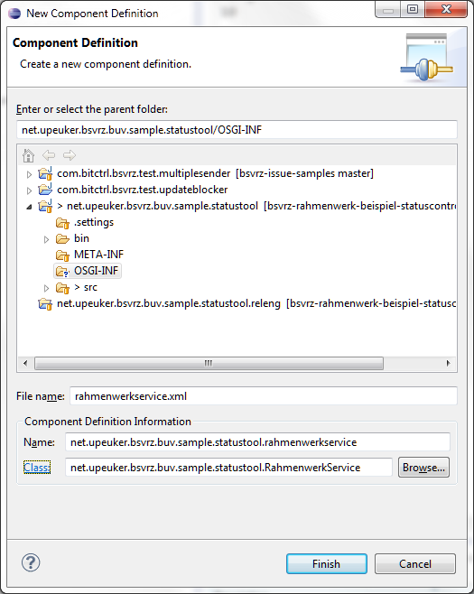

Services	
========
	 
## Allgemeines

Die Funktionalität des Rahmenwerks wird im Wesentlichen über OSGI-Services bereitgestellt, 
diese Ersetzen die bisher verwendeten Singletons wie DaVVerbindung, 
EinstellungsSpeicher, OberflächenFunktionen, ...

Der Zugriff auf die Services kann auf verschiedenen Wegen erfolgen:

### Service-Komponente

Ein Plug-in, das Rahmenwerk-Services benötigt, installiert eine Komponente, die von den entsprechenden 
Services abhängig ist. Die Komponente wird im Rahmen der Initialisierung des OSGI-Frameworks 
mit den notwendigen Informationen versorgt und aktiviert, wenn alle Voraussetzungen 
für ihren Betrieb vorliegen.

Eine Komponente besteht aus einer Beschreibungsdatei im xml-Format und einer Implementierung der Klasse, 
die die die Komponente bildet.

Das im folgende verwendete Beispiel ist unter der URL:
[https://github.com/upeuker/bsvrz-rahmenwerk-beispiel-statuscontrol](https://github.com/upeuker/bsvrz-rahmenwerk-beispiel-statuscontrol)
verfügbar.

Die Beschreibungsdatei liegt üblicherweise in einem Unterverzeichnis "OSGI-INF" des Plugin-Projekts.

 

Die Beschreibungsdatei kann händisch oder über den Assistenten der Eclipse IDE angelegt werden:

 

Beispielhaft soll hier eine Komponente angelegt werden, die die Services "Rahmenwerk", "Berechtigungen" und "Einstellungen" des Rahmenwerks integriert.

Auf der Startseite des Assistenten werden der Name der Definitionsdatei, ein eindeutiger Name für die Komponente und die implementierende Klasse angegeben.

 

Nach Abschluss des Assistenten öffnet sich der Editor für die Komponentendatei.

 

Auf Übersichtsseite können mindestens folgende Informationen bearbeitet werden:

- der Name der Komponente 
- die implementierende Klasse
- die Namen der Funktionen zum Aktivieren und Deaktivieren der Komponente (Standard: activate, deactivate)

Auf der Seite "Services" werden die erwarteten und veröffentlichten Services definiert, im Beispiel für die drei oben genannten:

 
 
Die dritte Seite zeigt die Quelle der Definitionsdatei, die wie folgt aussehen sollte:

```xml
<?xml version="1.0" encoding="UTF-8"?>
<scr:component xmlns:scr="http://www.osgi.org/xmlns/scr/v1.1.0"
                  name="net.upeuker.bsvrz.buv.sample.statustool.rahmenwerkservice">
   <implementation class="net.upeuker.bsvrz.buv.sample.statustool.RahmenwerkService"/>
   <reference bind="bindRahmenwerk" cardinality="1..1" 
   			  interface="de.bsvrz.buv.rw.basislib.Rahmenwerk" 
   			  name="Rahmenwerk" policy="static" 
   			  unbind="unbindRahmenwerk"/>
   <reference bind="bindBerechtigungen" cardinality="1..1" 
              interface="de.bsvrz.buv.rw.basislib.berechtigung.Berechtigungen" 
              name="Berechtigungen" 
              policy="static" 
              unbind="unbindBerechtigungen"/>
   <reference bind="bindEinstellungen" cardinality="1..1" 
              interface="de.bsvrz.buv.rw.basislib.einstellungen.Einstellungen" 
              name="Einstellungen" 
              policy="static" 
              unbind="unbindEinstellungen"/>
</scr:component>
```

Die Implementierung der Klasse "Rahmenwerkservice" sieht dann folgendermaßen aus:

```java
public class RahmenwerkService {

    private static RahmenwerkService service;
    private Rahmenwerk rahmenWerk;
    private Berechtigungen berechtigungen;
    private Einstellungen einstellungen;

    public static RahmenwerkService getService() {
        return RahmenwerkService.service;
    }

    protected void activate() {
        RahmenwerkService.service = this;
    }

    protected void deactivate() {
        RahmenwerkService.service = null;
    }

    protected void bindRahmenwerk(final Rahmenwerk newRahmenWerk) {
        this.rahmenWerk = newRahmenWerk;
    }

    @SuppressWarnings("unused")
    protected void unbindRahmenwerk(final Rahmenwerk oldRahmenWerk) {
        this.rahmenWerk = null;
    }

    public Rahmenwerk getRahmenWerk() {
        return rahmenWerk;
    }

    protected void bindBerechtigungen(final Berechtigungen newBerechtigungen) {
        this.berechtigungen = newBerechtigungen;
    }

    @SuppressWarnings("unused")
    protected void unbindBerechtigungen(final Berechtigungen oldBerechtigungen) {
        this.berechtigungen = null;
    }

    public Berechtigungen getBerechtigungen() {
        return berechtigungen;
    }

    protected void bindEinstellungen(final Einstellungen newEinstellungen) {
        this.einstellungen = newEinstellungen;
    }

    @SuppressWarnings("unused")
    protected void unbindEinstellungen(final Einstellungen oldEinstellungen) {
        this.einstellungen = null;
    }

    public Einstellungen getEinstellungen() {
        return einstellungen;
    }
}
```

Implementiert werden müssen in diesem Fall mindestens die Funktionen zum Aktivieren/Deaktivieren 
der Komponente, sowie die Funktionen zum Binden der erwarteten Services.

Die Komponente muss noch in der MANIFEST.MF eingebunden werden, was beim Anlegen der Komponente über den Assistenten automatisch erfolgt:

```
    ....
    Service-Component: OSGI-INF/rahmenwerkservice.xml
    ....     
```
 
Das Verzeichnis muss außerdem noch in der Datei build.properties zum Export in den Binary-Build des Plug-ins übernommen werden.

Das Plug-in, das die Komponente installiert, hat damit volle Kontrolle über die Verfügbarkeit 
der notwendigen Services.   
 
### Zugriff über den Bundle-Aktivator

Der Aktivator eines Bundles (Plug-ins) hat Zugriff auf die Service-Registry des Rahmenwerks.
Aus dieser kann der gewünschte Service ermittelt werden. 

Nachstehend wird beispielhaft der verfügbare Service *Rahmenwerk* ermittelt:

```java
public Rahmenwerk getRahmenwerk() {
    final IEclipseContext serviceContext = EclipseContextFactory
                .getServiceContext(getBundle().getBundleContext());
    return serviceContext.get(Rahmenwerk.class);
}
```

     
Zu beachten ist dabei, dass der Zugriff auf die Services auf diesem Weg erst erfolgen kann, 
wenn das Plug-in aktiviert wurde. Insbesondere sollten keine Klassen, die über ExtensionPoints 
instantiiert werden, auf die Services zurückgreifen.

### Zugriff über Dependency Injection

Der eleganteste Weg wäre der Zugriff auf die Services wäre die Verwendung von Dependency Injection, 
die integraler Bestandteil der E4 Platform ist.

Da jedoch auf Grund des aktuellen Status der E4 Komponenten und Entwicklungswerkzeuge, sowie im 
Hinblick auf die möglichst hohe Kompatibilität der bestehenden BuV-Software-Komponenten, entschieden
wurde, die Eclipse RCP Platform im Kompatibilitätsmodus zu Eclipse 3 zu betreiben, stehen die 
entsprechenden Möglichkeiten nicht vollumfänglich zur Verfügung.

Prinzipiell ist es jedoch möglich, neue Plug-ins und Komponenten als Erweiterung des vorhandenen
Applikationsmodells als reine E4 modellbasierte Bestandteile zu integrieren oder alternativ die
Eclipse3-Bridge aus dem E4-Tools-Projekt einzusetzen, um die Möglichkeiten des Dependency Injection-Mechanismus
zu verwenden.

Entsprechende Literatur und Online-Artikel sind in großem Umfang vorhanden, deshalb wird hier 
nicht näher darauf eingegangen.

Nachstehend sind die grundlegenden vom Rahmenwerk bereitgestellten Services überblicksmäßig dargestellt.

## Rahmenwerk

Der Service stellt im Wesentlichen die Verbindung zum Datenverteilersystem zur Verfügung mit dem
die Oberfläche verbunden werden soll.

Daneben werden einige Informationen zur allgemeinen Anwendungsumgebung geliefert, 
die optional auch im Offline-Betrieb zur Verfügung stehen. 

```java
public interface Rahmenwerk {

    String JOB_FAMILY = "RahmenwerkJobs";

    ArgumentList getStartParameter();
    String getBenutzerName();
    SystemObject getBenutzer();
       
    boolean isOnline();
    ClientDavInterface getDavVerbindung();

    void addDavVerbindungsListener(DavVerbindungsListener listener);
    void removeDavVerbindungsListener(DavVerbindungsListener listener);

    String getPasswort();
    boolean usesBerechtigungenNeu();
      
    SystemObject getOberflaechenObject();
    RwToolBarManager getRwToolBarManager();
}
```

### isOnline und getDavVerbindung
Die beiden Methoden dienen zur Überprüfung und zum Ermitteln der potentiell vorhandenen Datenverteilerverbindung.
Der Service bietet außerdem die Möglichkeit, sich für die Benachrichtigung über den Zustandswechsel 
der Datenverteilerverbindung zu registrieren. 

### add/removeDavVerbindungsListener
Die Methode dient zur Anmeldung eines Listeners, der über den Status der Datenverteilerverbindung des
Rahmenwerks informiert wird.

```java
public interface DavVerbindungsListener {

    /**
     * es wurde eine Datenverteilerverbindung hergestellt.
     * 
     * @param event
     *            die Daten des Ereignisses
     */
    void verbindungHergestellt(DavVerbindungsEvent event);

    /**
     * es wurde eine Datenverteilerverbindung getrennt.
     * 
     * @param event
     *            die Daten des Ereignisses
     */
    void verbindungGetrennt(DavVerbindungsEvent event);

    /**
     * eine Datenverteilerverbindung soll getrennt werden. Der Listener kann
     * hier ein Veto einlegen, sollte aber versuchen einen Zustand zu erreichen,
     * der beim einem der nächsten Aufrufe kein Veto mehr erfordert.
     * 
     * @param event
     *            die Daten des Ereignisses
     * @return <code>true</code>, wenn die Datenverteilerverbindung offen
     *         gehalten werden soll, <code>false</code> sonst (kein Veto)
     */
    boolean verbindungHalten(DavVerbindungsEvent event);
}
```

### JOB_FAMILY
Das Eclipse-Framework bietet die Möglichkeit, mit der Jobs-API Aufgaben im Hintergrund auszuführen.
Wenn in einem Plug-in ein Hintergrund-Job implementiert wurde, der unbedingt noch beendet werden muss, bevor die gesamte Applikation beendet wird, dann kann dies erreicht werden, indem der Job der hier definierten
JOB_FAMILY zugeordnet wird.

Um einen Job der Familie zuzuordnen, muss bei der Implementierung des konkreten Jobs die Funktion *belongsTo* implementiert werden, wie 
nachstehend beispielhaft dargestellt ist:

```java
@Override
public boolean belongsTo(final Object family) {
    return Rahmenwerk.JOB_FAMILY.equals(family) || super.belongsTo(family);
}
```

Die Blockierung des Rahmenwerks ist nur bedingt sicher, ein "forced" -Abbruch ist jederzeit möglich!      

### getXXX-Funktionen
Die get-Funktionen liefern spezielle Informationen zur Rahmenwerk-Applikation:

- die übergebenen Kommandozeilen-Argumente
- den Name des angemeldeten Benutzers im Online-Betrieb
- das Systemobjekt das angemeldeten Benutzers im Online-Betrieb
- das bei der Herstellung der Datenverteilerverbindung eingegebene Passwort
- die Art der verwendeten Berechtigungsklassen
- das Objekt an dem die Parameter für die Bedienoberfläche hinterlegt sind (im Online-Betrieb) 
- den Toolbar-Manager des Hauptfensters der Rahmenwerks-Applikation
	
## Einstellungen
Der Service bietet den Zugriff auf die allgemeinen und benutzerspezifischen Einstellungen 
des Rahmenwerks.

Der Service wird durch eine Instanz der Schnittstelle *Einstellungen* implementiert.

```java
public interface Einstellungen {

    /**
     * liefert die für die übergebene Adresse vorliegende Einstellung.
     * 
     * @param adresse
     *            die Adresse
     * @return das Einstellungsobjekt
     * @throws IOException
     *             die Einstellung konnte nicht gelesen werden
     */
    Object getValue(final EinstellungsAdresse adresse) throws IOException;

    /**
     * setzt für die übergebene Adresse die angegebene Einstellung.
     * 
     * @param adresse
     *            die Adresse
     * @param einstellung
     *            das Einstellungsobjekt
     * @throws IOException
     *             die Einstellung konnte nicht gelesen werden
     */
    void setValue(final EinstellungsAdresse adresse, final Object einstellung)
                throws IOException;

    /**
     * setzt für die übergebene Adresse die angegebene Einstellung mit den
     * übergebenen Urlasserinformationen.
     * 
     * @param adresse
     *            die Adresse
     * @param einstellung
     *            das Einstellungsobjekt
     * @param urlasser
     *            die Urlasserinformationen
     * @throws IOException
     *             die Einstellung konnte nicht gelesen werden
     */
    void setValue(final EinstellungsAdresse adresse, final Object einstellung,
                final UrlasserInfo urlasser) throws IOException;

    /**
     * entfernt die unter der übergebenen Adresse hinterlegten Einstellungen.
     * 
     * @param adresse
     *            die Adresse
     */
    void removeValue(EinstellungsAdresse adresse);

    /**
     * fügt einen Listener hinzu, der über Änderungen von Einstellungen
     * informiert wird.
     * 
     * @param listener
     *            der Listener
     */
    void addEinstellungsListener(final EinstellungChangeListener listener);
    
    /**
     * fügt einen Listener hinzu, der über Änderungen von Einstellungen der
     * angegebenen Kategorie informiert wird.
     * 
     * @param listener
     *            der Listener
     * @param category
     *            die Kategorie
     */
    void addEinstellungsListener(final EinstellungChangeListener listener,
                final String category);

    /**
     * entfernt einen Listener, der über Änderungen der Einstellungen informiert
     * wurde.
     * 
     * @param listener
     *            der Listener
     */
    void removeEinstellungsListener(final EinstellungChangeListener listener);

    /**
     * entfernt einen Listener, der über Änderungen der Einstellungen in der
     * angegebenen Kategorie informiert wurde.
     * 
     * @param listener
     *            der Listener
     * @param category
     *            die Kategorie
     */
    void removeEinstellungsListener(final EinstellungChangeListener listener,
                final String category);

    /**
     * fügt einen Listener hinzu, der über die Verfügbarkeit des
     * Einstellungsspeichers informiert wird.
     * 
     * @param listener
     *            der Listener
     */
    void addEinstellungsAvailabilityListener(
                final EinstellungAvailabilityListener listener);

    /**
     * entfernt einen Listener, der über die Verfügbarkeit des
     * Einstellungsspeichers informiert wird.
     * 
     * @param listener
     *            der Listener
     */
    void removeEinstellungsAvailabilityListener(
                final EinstellungAvailabilityListener listener);
}
```

Eine detaillierte Beschreibung des Zugriffs auf die Einstellungen erfolgt in einem gesonderten Kapitel. 

## Berechtigungen	 
Der Service bietet den Zugriff auf die von den Plug-ins des Rahmenwerks definierten Berechtigungen
mit den in der Regel bestimmte Funktionalitäten auf Berechtigungsklassen bezogen verfügbar gemacht oder
entzogen werden können. 

Der Service wird durch eine Instanz der Schnittstelle *Berechtigungen* implementiert.

```java
public interface Berechtigungen {

    /**
     * Fügt eine Funktion zur Liste der Funktionen mit Berechtigungen hinzu.
     * 
     * @param funktion
     *            Funktion, die hinzugefügt werden soll.
     */
    void addOberflaechenFunktion(final FunktionMitBerechtigung funktion);

    /**
     * Entfernt eine Funktion aus der Liste der Funktionen mit Berechtigungen.
     * 
     * @param id
     *            ID der Funktion, die entfernt werden soll.
     */
    void removeOberflaechenFunktion(final String id);

    /**
     * liefert die registrierten Funktionen.
     * 
     * @return die Menge der Funktionen
     */
    Collection<FunktionMitBerechtigung> getFunktionen();

    /**
     * prüft, ob der als SystemObject übergebene Benutzer, die Berechtigung für
     * die angegebene Funktion besitzt.
     * 
     * @param benutzer
     *            der Benutzer
     * @param funktion
     *            die Funktion
     * @return der Zustand der Berechtigung
     */
    boolean hasBerechtigung(SystemObject benutzer,
                FunktionMitBerechtigung funktion);

    /**
     * prüft, ob der Benutzer mit der übergebenen PID, die Berechtigung für die
     * angegebene Funktion besitzt.
     * 
     * @param benutzerPid
     *            die PID
     * @param funktion
     *            die Funktion
     * @return der Zustand der Berechtigung
     */
    boolean hasBerechtigung(String benutzerPid, FunktionMitBerechtigung funktion);

    /**
     * liefert die Funktion mit der angegebenen Id oder <code>null</code>, wenn
     * keine solche existiert.
     * 
     * @param id
     *            die ID
     * @return die Funktion oder <code>null</code>
     */
    FunktionMitBerechtigung getFunktion(String id);

    /**
     * liefert einen Sammlung der verfügbaren Berechtigungsklassen (als
     * SystemObject).
     * 
     * @return die Berechtigungsklassen
     */
    Collection<SystemObject> getBerechtigungsKlassen();

    /**
     * fügt einen Listener hinzu, der über Anderungen von Berechtigungen
     * informiert wird.
     * 
     * @param listener
     *            der Listener
     */
    void addOberflaechenFunktionsListener(IBerechtigungListener listener);

    /**
     * fügt einen Listener hinzu, der über Änderungen von Berechtigungen der
     * angegebenen Funktion informiert wird.
     * 
     * @param listener
     *            der Listener
     * @param funktion
     *            die Funktion
     */
    void addListenerForFunktion(IBerechtigungListener listener,
                FunktionMitBerechtigung funktion);

    /**
     * entfernt einen für Änderungen von Berechtigungen angemeldeten Listener.
     * 
     * @param listener
     *            der Listener
     */
    void removeListener(IBerechtigungListener listener);
```

Eine detaillierte Beschreibung des Zugriffs auf die Berechtigungen erfolgt in einem gesonderten Kapitel. 
