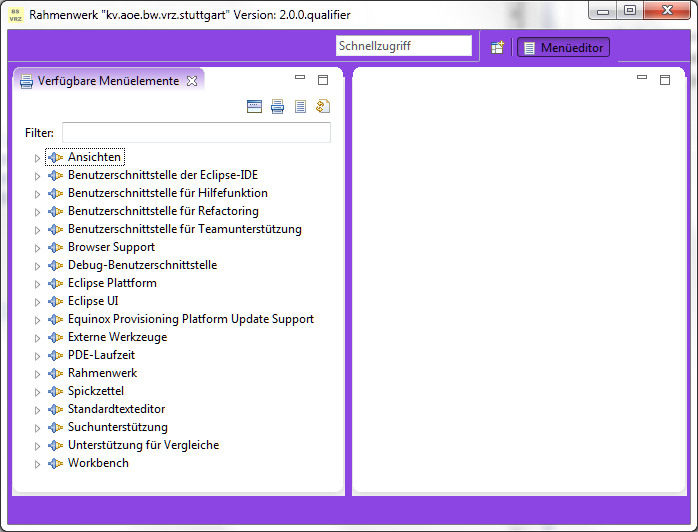

Simulation
==========

Die Unterstützung von Simulationsvarianten innerhalb des Rahmenwerks ist momentan aus
verschiedenen Gründen nur als Proof of Concepts zu betrachten.

- der Umgang der Plug-ins des Rahmenwerks und die Behandlung unvollständig 
  parametrierter bzw. nicht konfigurierter Simulationen ist momentan nicht
  vollständig geklärt
- lokale Einstellungen des Rahmenwerks werden in einem zentralen Verzeichnis
  abgelegt, d.h. sie gelten auch für die Simulation und könnten im Rahmen der Simulation
  mit Auswirkungen auf den "Normalbetrieb" verändert werden
- das Eclipse 4 Framework bietet zwar die Möglichkeit per Theming die Optik der Workbench
  zu ändern. Die zur Verfügung stehende Funktionalität ist aber derzeit teileweise
  noch im Incubation-Status und die Tools und die Dokumentation für das Theming noch
  relativ unvollständig.
  
Das Rahmenwerk kann über die Standard-Datenverteilerparameter (*-simVariante*) mit einer
Standardsimulationsvariante ausgeführt werden.
  
Folgende Möglichkeiten in Bezug auf die Simulationsvarianten bietet das Rahmenwerk
derzeit:

## Anpassung des Layouts

Das Rahmenwerk stellt zwei Themes zur Verfügung, Standard- und Simulationsdarstellung.
Die Themes sind als ExtensionPoints definiert und per CSS-Datei anpassbar.

Das Rahmenwerk-Plug-in selbst wird nicht als jar-Archiv sondern in extrahierter
Form installiert, um den einfachen Zugriff auf die CSS-Dateien zu ermöglichen. 

Die CSS-Dateien "defaultstyle.css" und "simulation.css" sind im Unterverzeichnis
*css* des Rahmenwerk-Plug-ins zu finden.

Das Theme "Simulation" wird aktiviert, wenn eine Simulationsvariante beim Start des 
Rahmenwerks übergeben wurde und eine Datenverteilerverbindung besteht. 

 

Momentan wird die Hintergrundfarbe des Hauptfensters manipuliert.

## Anzeige der Simulationsvariante als statische Information

Die eingestellte Simulationsvariante kann optional als statische Information im Titel der
Anwendung oder in der Statuszeile eingeblendet werden.

