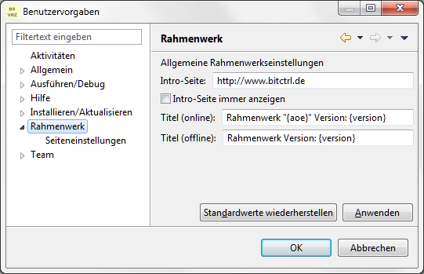

Startbildschirm
===============

## Hintergrund

Der Startbildschirm des Rahmenwerks wird durch eine Intro-Seite ersetzt, die die 
bisherige App-Perspektive ersetzt.

Eine Standardperspektive wird beim Neustart des Rahmenwerks nicht gesetzt.

Die Introseite repräsentiert lediglich ein Browserwidget, das mit beliebigem Inhalt
gefüllt werden kann.

Standardmäßig wird die Seite nur einmalig beim Start angezeigt, sofern das nicht
anders festgelegt wurde, oder wenn beim Starten der Workbench keine Perspektive
aktiviert wurde.

## Konfiguration der Startansicht

Der Inhalt der Startansicht kann über einen Kommandozeilenparameter oder über
die lokale Einstellungen des Rahmenwerks vorgenommen nachdem dieses aktiviert wurde.

Als Startoption steht der Parameter:

```bash
-introUrl=<URL des anzuzeigenden Inhalts>
```

zur Verfügung. Dieser hat Vorrang gegenüber anderen Einstellungen.

Innerhalb des Rahmenwerks kann über lokale Benutzereinstellungen das Verhalten des
Startbildschirms definiert werden.

 

Einstellbar sind:
- die anzuzeigende URL innerhalb der Willkommenseite
- ob die Willkommenseite bei jedem Start des Rahmenwerks angezeigt werden soll, 
  womit beispielsweise aktuelle Nachrichten über einen projektinternen Webserver
  publiziert werden könnten. 


 
